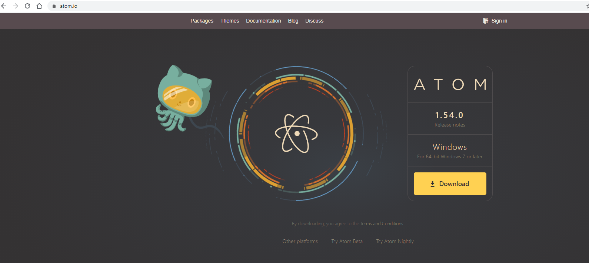
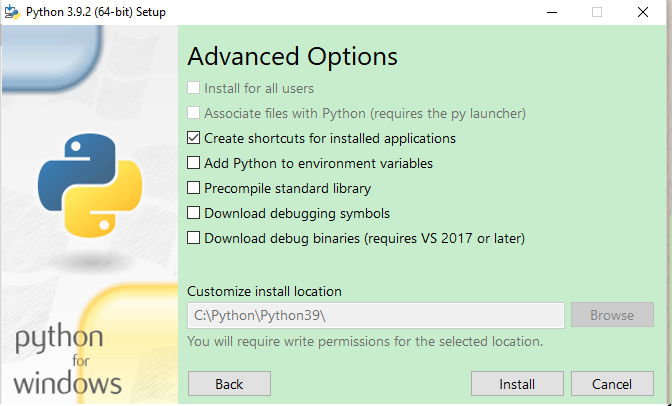

# Shaastra workshop

# Installation

## Day 1

### Atom IDE

- Visit https://atom.io/ and click download



- It will show a dialog box stating download in progress


- Done


### Python

- Visit https://www.python.org/downloads/ and click download for 3.9.2


- Click custom installation and check adding python to path.


- Check all the optional features here.


- Change the directory to C:\Python\Python39, my screenshot will look a little bit different to yours as I have installed earlier.


- Click Disable path length limit and click yes in the next dialog box.



- You can see python installed when you search python in start menu.

### Git

- To download the Git installer, visit the Git's official site and go to download page. The link for the download page is https://git-scm.com/downloads. The page looks like as


- Click on the package given on the page as download 2.30.1 for windows. The download will start after selecting the package, I have version 2.23.0 thus some pages maybe a bit different , if a new page occurs choose the default option.

- Click on the downloaded installer file and select yes to continue. After the selecting yes the installation begins


- Default components are automatically selected in this step. You can also choose your required part, for now default components are enough


- The default Git command-line options are selected automatically. You can choose your preferred choice. Click next to continue.


- The default transport backend options are selected in this step. Click next to continue.


- Select your required line ending option and click next to continue.


- Select preferred terminal emulator clicks on the next to continue with the default checked one.


- This is the last step that provides some extra features like system caching, credential management and symbolic link. Select the required features and click on the next option.


- The Git installation is completed

## Day 2

### Python Libraries
- Most of the downloads for today would be python libraries 
- Step open start menu search command prompt and open it

:max_bytes(150000):strip_icc()/open-command-prompt-w10-5c19531146e0fb00013852e8.png)
- Type in the following commands one by one
```
pip install urllib3
pip install requests
pip install beautifulsoup4
pip install ssl
```

- We will look at more libraries during the workshop

### Heroku cli
- The heroku cli can be downloaded in this [link](https://devcenter.heroku.com/articles/heroku-cli)


- Select the Start  button, then select Settings > System > About > Open About settings
- At the right, under Device specifications, see System type or alternatively [check here](https://support.microsoft.com/en-us/windows/32-bit-and-64-bit-windows-frequently-asked-questions-c6ca9541-8dce-4d48-0415-94a3faa2e13d).
- Install the 64 bit ( most or all of the recents pcs work with this) if your system type is 64 bit and vice versa
- Open the installer, check all the below options


- Install in the preferred location


