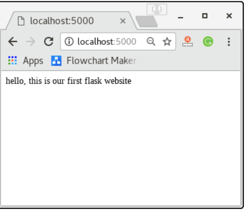
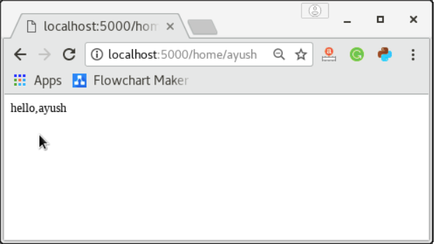
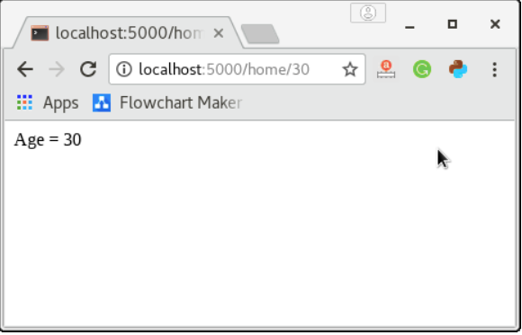
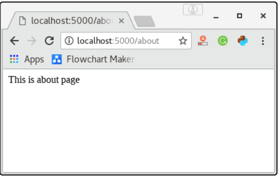
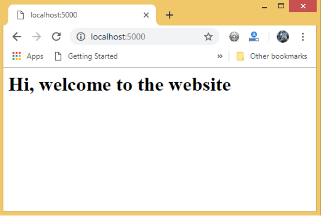
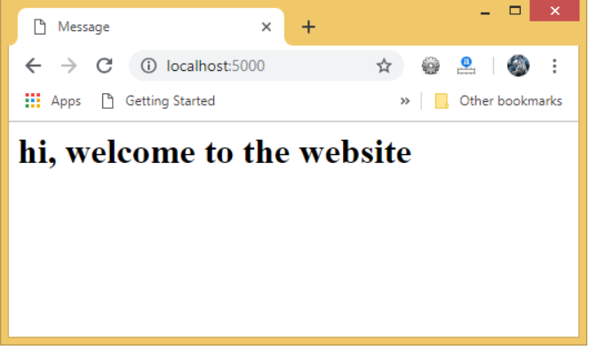
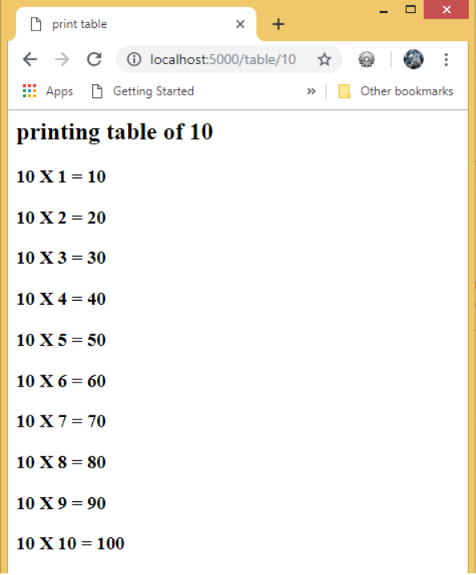
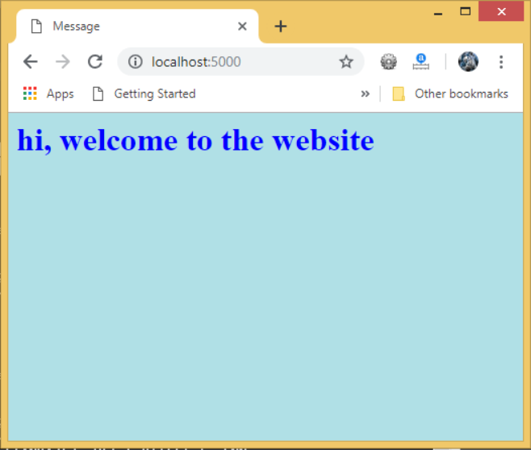

# Shaastra workshop

                           


## Installation Guides

- Click this [link](installation/installation.md)

## DAY 1

### Python

- Click the below link to open intro to python using colab
[](https://colab.research.google.com/drive/1y-4wfcCW_ijFzkwXREsfsYTCxZjKh1LN)

### HTML

- Follow this link to [view](HTML/README.md)

### Git

- Visit this [link](https://github.com/) and create your github account
- Fork this repo and copy the link , which is shown in the below image
- open command prompt from start menu and use
```
git clone https\\:the_link_you_cloned
```
- All the below commands should be followed when you make changes to the repository
- Initailising the repository, (not required in our case)
```
git init
```
- Add the contents of the repo
```
git add .
```
- Add a particular file
```
git add test.txt
```
- To check status
```
git status
```
- To commit the changes
```
git commit -m "  commit message"
```
- To push the changes to the server
```
git push -u origin main
```
- To get changes uploaded to the server by others to local folder, do this before making your own changes
```
git pull
```
- [Detailed tutorial](https://www.youtube.com/watch?v=uR6G2v_WsRA) for git

## Day 2

### Webscraping

Head onto to the below link to start webscraping

[](https://colab.research.google.com/drive/1U8a4kpGF52Bk7-n0bZjZ5_YGEmAJB1Qu?usp=sharing)

### Flask and integrating different pages

- Open command prompt and create an environment, Create a project folder and a venv folder within:
```
mkdir myproject
cd myproject
py -3 -m venv venv
```
- Python 3 comes inbuilt with virtual environment

- Before you work on your project, activate the corresponding environment:
```
venv\Scripts\activate
```
Your shell prompt will change to show the name of the activated environment.

- Within the activated environment, use the following command to install Flask:
```
pip install Flask
```
Flask is now installed and the basic setup is done. We can start interconnecting the webpages to display realtime data

### Hello world in flask

- Save the file as backend.py
```
from flask import Flask  

app = Flask(__name__) #creating the Flask class object
#We need to pass the name of the current module, i.e. __name__ as the argument into the Flask constructor.

@app.route('/') #decorator drfines the   
def home():  
    return "hello world";
#can return a string to be printed on the browser's window or we can use the HTML template to return the HTML file as a response from the server.

if __name__ =='__main__':  
    app.run(debug = True)  
```
- And run
```
python backend.py
```
- The following screen will be displayed in command prompt


- And browser output



- The route() function of the Flask class defines the URL mapping of the associated function. The syntax is given below.

```
app.route(rule, options)  
```
- rule: It represents the URL binding with the function.
- options: It represents the list of parameters to be associated with the rule object

- the run method of the Flask class is used to run the flask application on the local development server.

```
app.run(host, port, debug, options)  
```
- [further reads](https://github.com/pallets/flask/issues/2109)


### Flask App routing
App routing is used to map the specific URL with the associated function that is intended to perform some task. It is used to access some particular page in the web application.

Flask facilitates us to add the variable part to the URL by using the section. We can reuse the variable by adding that as a parameter into the view function. Consider the following example.

```
from flask import Flask  
app = Flask(__name__)  

@app.route('/home/<name>')  
def home(name):  
    return "hello,"+name;  

if __name__ =="__main__":  
    app.run(debug = True)  
```


- The converter can also be used in the URL to map the specified variable to the particular data type. For example, we can provide the integers or float like age or salary respectively.

```
from flask import Flask  
app = Flask(__name__)  

@app.route('/home/<int:age>')  
def home(age):  
    return "Age = %d"%age;  

if __name__ =="__main__":  
    app.run(debug = True)  
```


- The following converters are used to convert the default string type to the associated data type.
  - string: default
  - int: used to convert the string to the integer
  - float: used to convert the string to the float.
  - path: It can accept the slashes given in the URL.

### The add_url_rule() function
There is one more approach to perform routing for the flask web application that can be done by using the add_url() function of the Flask class. The syntax to use this function is given below.

```
add_url_rule(<url rule>, <endpoint>, <view function>)  
```
```
from flask import Flask  
app = Flask(__name__)  

def about():  
    return "This is about page";  

app.add_url_rule("/about","about",about)  

if __name__ =="__main__":  
    app.run(debug = True)  
```



So thats it for intro with flask , there are a lot more functions if interested you can check out , lets head to build our own app

### Flask Templates
- Lets see how we can return html templates instead of normal strings.
- The following flask script contains a view function, i.e., the message() which is associated with the URL '/'. Instead of returning a simple plain string as a message, it returns a message with `<h1>` tag attached to it using HTML.

```
from flask import *  
app = Flask(__name__)  
@app.route('/')  
def message():  
      return "<html><body><h1>Hi, welcome to the website</h1></body></html>"  
if __name__ == '__main__':  
   app.run(debug = True)  
```


 - To render an HTML file from the view function, let's first create an HTML file named as message.html.
```
<!--message.html-->
<html>  
<head>  
<title>Message</title>  
</head>  
<body>  
<h1>hi, welcome to the website </h1>  
</body>  
</html>
```
- Here, we must create the folder templates inside the application directory and save the HTML templates referenced in the flask script in that directory. Assuming script.py is in E:\flask whereas the path of the HTML template is E:\flask\templates.
```
#script.py
from flask import *  
app = Flask(__name__)  

@app.route('/')  
def message():  
      return render_template('message.html')  
if __name__ == '__main__':  
   app.run(debug = True)
```


### Embedding Python statements in HTML
- Due to the fact that HTML is a mark-up language and purely used for the designing purpose, sometimes, in the web applications, we may need to execute the statements for the general-purpose computations. For this purpose, Flask facilitates us the delimiter  which can be used to embed the simple python statements into the HTML.

- `{{ ... }}` Delimiter for expressions to print to the template output

- Other delimiters

```
 for statements
{# ... #} for the comments that are not included in the template output
# ... ## for line statements
```

- Let us print the table of a number specified in the URL, i.e., the URL `http://localhost:5000/table/10` will print the table of 10 on the browser's window.

- The for-loop statement is enclosed inside `` delimiter, whereas, the loop variable and the number is enclosed inside `{{ ... }}` placeholders.

```
#script.py

from flask import *  
app = Flask(__name__)  

@app.route('/table/<int:num>')  
def table(num):  
      return render_template('print-table.html',n=num)  
if __name__ == '__main__':  
   app.run(debug = True)  
print-table.py
```
```
<!-- print-table.html -->
<html>  
<head>  
<title>print table</title>  
</head>  
<body>  
<h2> printing table of {{n}}</h2>  
  
    <h3>{{n}} X {{i}} = {{n * i}} </h3>  
  
</body>  
</html>  
```


## Referring Static files in HTML

- The static files such as CSS or JavaScript file enhance the display of an HTML web page. A web server is configured to serve such files from the static folder in the package or the next to the module. The static files are available at the path /static of the application.

```
#script.py

from flask import *  
app = Flask(__name__)  

@app.route('/')  
def message():  
      return render_template('message.html')  
if __name__ == '__main__':  
   app.run(debug = True)  
```
```
<!-- message.html -->
<html>  
<head>  
    <title>Message</title>  
    <link rel="stylesheet" href="{{ url_for('static', filename='css/style.css') }}">  
</head>  

<body>  
    <h1>hi, welcome to the website</h1>  
</body>  
</html>  
style.css

body {  
  background-color: powderblue;  
}  
h1 {  
  color: blue;  
}  
p {  
  color: red;  
}
```



## Hosting with heroku

- Follow this [link](Heroku/heroku.md)

## Further study resources

